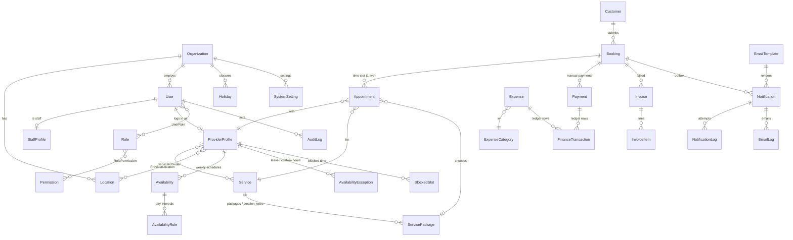

# ShifaWorks Booking — Architecture

The booking and management layer behind the ShifaWorks WordPress site. The site's "Book Appointment"
buttons link straight to one dedicated form per service (`booking.shifaworks.com/hijama-therapy`, …).
There is no service catalogue, no customer account, and no form builder: customers fill in a form,
receive payment instructions by email, pay manually, and staff verify the payment.

## 0. Scope and decisions

This application evolves an earlier general-purpose build (phases 1–9 of a previous plan). What it
reuses is proven and tested; what the ShifaWorks brief excludes is removed.

| Kept (adapted)                                                                   | Removed                                                          |
| -------------------------------------------------------------------------------- | ---------------------------------------------------------------- |
| Monorepo, Express API, Next.js app, Supabase Auth for staff                      | Customer accounts, registration, login, customer portal          |
| Slot engine (pure, timezone-safe) and availability model                         | Service/provider/category browsing pages and APIs                |
| Booking transaction + PostgreSQL exclusion constraint (no double booking)        | Form builder, dynamic forms, form submissions                    |
| Invoices, ledger, expenses, CSV exports                                          | Online payment gateways, checkout, payment webhooks               |
| Email outbox with retries and logs; RBAC; audit log; settings; reports           | In-app notifications, automated WhatsApp, appointment reminders  |
|                                                                                   | Categories, appointment notes, participants                      |
|                                                                                   | Events, ticket types, capacity guards, QR tickets and check-in (removed after Phase 7 — out of scope) |

Development database: reset to the new schema (agreed); it held test data only.

Reused code is brought back module by module in the phase that owns it; until then it is parked,
uncompiled, under `apps/api/legacy/`, `apps/web/legacy/` and `packages/shared/legacy/` (the README
lists which phase restores what). The build stays green at the end of every phase.

**Decisions to confirm** (defaults chosen; easy to change):

- Every service form collects gender so providers can be matched (`acceptsMale` / `acceptsFemale`).
- Non-Hijama services also use *packages* for their priced options ("session types": assessment,
  individual session, …), so every booking has a package and an amount.
- Unpaid bookings keep their slot until staff cancel them. An optional setting
  (`booking.paymentWindowHours`, default `0` = off) cancels unpaid bookings automatically.
- Verifying a payment confirms the booking directly (`PAYMENT_VERIFIED` is used only if the
  `booking.autoConfirmOnVerify` setting is turned off).
- The service-specific questions in §11 are proposals for review in Phase 4.

---

## 1. Final architecture

```
 shifaworks.com (WordPress)          booking.shifaworks.com (Next.js 16, App Router)
 "Book Appointment" ───────────────▶ /hijama-therapy  /speech-therapy  …                   (public, no login)
                                     /admin/*  /provider/*  /login                         (Supabase Auth)
                                                    │  HTTPS JSON (Zod-validated both sides)
                                                    ▼
                                     api.shifaworks.com (Express 5 + TypeScript)
                                     ├── public routes    rate-limited, no auth, honeypot + idempotency
                                     ├── staff routes     Supabase JWT → principal → RBAC permission checks
                                     ├── services/        business logic (thin controllers)
                                     ├── booking engine   one transaction + exclusion constraint
                                     ├── outbox           notification rows written in the same transaction
                                     └── worker           email delivery, retries, housekeeping
                                                    │
                        ┌───────────────────────────┼─────────────────────────────┐
                        ▼                           ▼                             ▼
            Supabase PostgreSQL (Prisma 7)   Supabase Storage             Email provider
            RLS on, no policies: only the    public: provider photos,     SMTP / Resend
            API (table owner) can read/write private: payment proofs,     (console in development)
                                             expense receipts             Redis + BullMQ optional
```

- **Monorepo** (npm workspaces): `packages/shared` (Zod schemas, types, per-service form
  definitions, permission catalogue — used by both apps), `apps/api`, `apps/web`.
- **One source of truth.** The web app never decides availability, price or status. It renders what
  the API returns and re-submits; the API re-validates everything.
- **Background work** runs in the API process by default (in-process worker, DB-driven). With
  `QUEUE_ENABLED=true` and Redis, BullMQ distributes it to `npm run worker` processes. Redis is never
  needed for correctness.
- **Timezone.** Everything is stored in UTC. Availability and "today" are computed in the
  organisation's (or location's / provider's) IANA zone, default `Asia/Karachi` — never the browser's.

### Project structure

```
packages/shared/src
  enums.ts, permissions.ts, api.ts, validation.ts
  service-forms/            one file per service: steps, Zod schema, review labels
    common.ts               personal + location + terms schemas shared by all forms
    hijama-therapy.ts       hijamaBookingSchema
    speech-therapy.ts       speechTherapyBookingSchema
    islamic-life-coaching.ts, faith-based-counseling.ts, clinical-counseling.ts
    index.ts                SERVICE_FORMS registry keyed by slug
  bookings.ts, providers.ts, services.ts, finance.ts, notifications.ts, reports.ts, settings.ts
apps/api/src
  modules/<module>/  *.routes.ts (thin)  *.service.ts (logic)  *.test.ts
    auth, users, roles, staff, providers, services, availability, bookings (engine),
    appointments, payments, invoices, finance, notifications, reports, settings,
    audit, files, locations, public (booking-form endpoints)
  jobs/ (scheduler, queues)  lib/ (prisma, redis, settings, supabase)  utils/  config/
  prisma/schema.prisma  prisma/migrations  prisma/seed.ts
apps/web/src/app
  (booking)/[service routes]  admin/*  provider/*  login  auth/callback
```

---

## 2. Database ERD



| Area            | Tables                                                                                               |
| --------------- | ---------------------------------------------------------------------------------------------------- |
| Access          | users, roles, permissions, role_permissions, user_roles, user_permissions, staff_profiles            |
| Providers       | provider_profiles, provider_locations, service_providers                                             |
| Services        | services, service_packages                                                                           |
| Availability    | availabilities, availability_rules, availability_exceptions, holidays, blocked_slots                 |
| Bookings        | customers, bookings, appointments                                                                    |
| Money           | payments, invoices, invoice_items, finance_categories, finance_transactions, expense_categories, expenses |
| Email           | email_templates, notifications (outbox/jobs), notification_logs, email_logs                          |
| Platform        | organizations, locations, files, audit_logs, system_settings, document_sequences                     |

## 3. Prisma schema

The schema is `apps/api/prisma/schema.prisma`. Design points:

- **Customers have no login.** `customers` is a contact record matched by email on each submission
  (so staff see history). Each `bookings` row also stores a **snapshot** of exactly what was
  submitted (name, email, phone, date of birth, gender, city, province, address): a later booking
  with the same email never rewrites an earlier one.
- **Critical fields are columns**: `appointments.providerId`, `serviceId`, `packageId`, `startsAt`,
  `endsAt` (appointment date and times, UTC + `timezone`), `status`, `paymentStatus`. Only the
  service-specific answers live in `bookings.formData` (JSON), always validated by the service's Zod
  schema, with `formVersion` recorded.
- **Statuses** (`BookingStatus`): `PENDING_PAYMENT`, `PAYMENT_SUBMITTED`, `PAYMENT_VERIFIED`,
  `CONFIRMED`, `CANCELLED`, `COMPLETED`, `NO_SHOW`, `RESCHEDULED`. **Payment** (`PaymentStatus`):
  `PENDING`, `VERIFIED`, `REJECTED`, `REFUNDED`. Bookings and appointments share the same lifecycle.
- **Providers** carry `gender`, `acceptsMale`, `acceptsFemale`, `designation`, `experienceYears`,
  `rating`, `profileImageId`, `isActive`. `userId` is optional: a provider can be listed and booked
  before they are invited to the provider dashboard.
- **Services** have `isActive` and `bookingEnabled`; the form is open only when both are true.
  `defaultDurationMinutes`, buffers, notice and advance limits drive slot generation.
  **Packages** (`service_packages`) hold name, description, points, duration and price.
- **Payments** are created `PENDING` with the booking and record who verified / rejected / refunded,
  when, the method, the transaction reference and an optional private proof file.
- **Database-enforced rules** (migration `*_constraints`):
  - `appointments_no_provider_overlap`: exclusion constraint on
    `(providerId, tstzrange(blockedFrom, blockedUntil))` for the slot-holding statuses
    `PENDING_PAYMENT, PAYMENT_SUBMITTED, PAYMENT_VERIFIED, CONFIRMED`.
  - CHECKs: time order, non-negative money, availability minutes, provider rating 0–5, provider
    accepts at least one gender, package price ≥ 0.
  - Row Level Security enabled on every table with no policies (browser keys can read nothing).
- Human-readable numbers `APT-2026-000001`, `PAY-…`, `INV-…`, `TXN-…`, `EXP-…`, `CUS-…` come from
  `document_sequences`, incremented inside the business transaction. Primary keys are UUIDs.

---

## 4. API contract

Base `https://api.shifaworks.com/api/v1`. JSON in and out, validated with Zod. Responses:
`{ success: true, data, meta? }` or `{ success: false, code, message, errors?: [{ path, message }] }`.
Codes: `400 BAD_REQUEST`, `401 UNAUTHENTICATED`, `403 FORBIDDEN`, `404 NOT_FOUND`,
`409 SLOT_UNAVAILABLE | CONFLICT | CAPACITY_EXCEEDED`, `410 SERVICE_CLOSED`,
`422 VALIDATION_ERROR`, `429 RATE_LIMITED`, `503 SERVICE_UNAVAILABLE`.

### Public (no login; rate-limited) — all under `/public`

One router with its own rate limits, so public paths never share a URL with the staff API below.

| Method | Path | Purpose |
| ------ | ---- | ------- |
| GET  | `/public/services/:slug` | Form bootstrap: name, description, `open` flag, active packages, support contacts (for the closed page), terms URL, currency. Never lists other services. |
| GET  | `/public/providers?service=:slug&gender=MALE\|FEMALE` | Provider cards for that service compatible with the gender: id, name, designation, experience, rating, photo. Filtering happens here, not in the browser. |
| GET  | `/public/availability/dates?service=&provider=&package=&from=&to=` | Dates (≤ 62 days) that have at least one free slot. |
| GET  | `/public/availability/slots?service=&provider=&package=&date=` | Free start times for one date, in UTC + display timezone. |
| POST | `/public/bookings/receipt` | Optional, its own step before submission: uploads a payment receipt (image or PDF, magic-byte sniffed) to the private bucket, anonymously — no booking exists yet. `201` → `{ id, ... }` (a `FileDto`); pass the id as `receiptFileId` on the submission below. Its own rate limit, same shape as the booking limiter. |
| POST | `/public/bookings` | Submit a service form. Header `Idempotency-Key` (a retried request with the same key returns the original booking; backed by the `bookings(organizationId, idempotencyKey)` unique index — Postgres treats multiple NULLs as distinct, so non-form bookings are unaffected). Body: `{ service, providerId, packageId, startsAt, personal, location, details, receiptFileId?, termsAccepted: true, website: "" }` (`service` and `details` route to the matching schema in `SERVICE_BOOKING_SCHEMAS`; `website` is a honeypot, rejected server-side by the schema itself; `location` no longer takes `address`, only `city`/`province`). If `receiptFileId` is set, the booking skips straight to `PAYMENT_SUBMITTED` (same status `POST /payments/:id/mark-submitted` reaches) instead of `PENDING_PAYMENT`, and the file becomes the payment's proof. A package's price is discounted server-side when the package has `discountEnabled` — the client only ever sees the already-discounted `price` plus `originalPrice`/`discountPercent` for display. `201` → `{ bookingNumber, status, paymentStatus, amount, currency, appointment, paymentInstructions, support }`. Built on `modules/appointments/booking-engine.ts` (`createAppointmentBooking`), the same function Phase 5's manual booking calls with `online: false`. |

### Staff and providers (Supabase JWT; permission per route)

| Area | Endpoints |
| ---- | --------- |
| Auth | `GET /auth/me`, `POST /auth/logout` (invite-only accounts, no sign-up) |
| Services | `GET /services`, `GET/PATCH /services/:idOrSlug` (active, booking enabled, name, description, duration, buffers, interval, notice, advance) · `PUT /services/:id/providers` · `POST /services/:id/packages`, `PATCH/DELETE /services/:id/packages/:packageId` (booked packages can only be hidden; `discountEnabled`/`discountPercent` set a simple on/off percentage discount, reflected everywhere the package's price appears — booking form, review step, booking/payment records, confirmation email/ticket). No create/delete: the five services are fixed. |
| Providers | `GET /providers` (`type`, `active`, `serviceId`, `gender`, `search`), `POST /providers`, `GET/PATCH/DELETE /providers/:id`, `PUT /providers/:id/services`, `POST /providers/:id/invite` (creates the THERAPIST/COUNSELLOR login and links it, links an existing staff account with that email, or re-sends) · `GET/PATCH /providers/me` (own card only) |
| Availability | `GET /availability/providers/:id`, `PUT …/:id/schedule`, `POST/DELETE …/:id/exceptions[/:exceptionId]`, `POST/DELETE …/:id/blocks[/:blockId]` (`:id` may be `me`; providers: own only) · `GET/POST/DELETE /availability/holidays` · `GET /availability/preview/dates`, `GET /availability/preview/slots` (staff preview on the same engine, no notice limit) |
| Files | `POST /files/images` (provider photos; type checked by magic bytes, 5 MB) |
| Bookings | `GET /bookings` (`status`, `paymentStatus`, `service`, `providerId`, `from`/`to`, `search`; providers: own only), `GET /bookings/:id`, `PATCH /bookings/:id/notes` (internal notes), `POST /bookings/manual` (customer + service + provider + date/time + package + optional "paid at the desk"; same engine and checks as the public forms, §8), `POST /bookings/:id/cancel`, `POST /bookings/:id/reschedule` (staff only), `POST /bookings/:id/confirm` (`PAYMENT_VERIFIED` → `CONFIRMED`; only reachable when `booking.autoConfirmOnVerify` is off — every other path to `CONFIRMED` goes through `POST /payments/:id/verify`), `POST /bookings/:id/complete`, `POST /bookings/:id/no-show` (staff or the appointment's own provider, only once it has started). Built on `modules/appointments/booking-engine.ts`; no separate `/appointments` endpoint — a booking and its live appointment are 1:1 for the APPOINTMENT type, so `/bookings` already serves the provider's own-appointments view. |
| Payments | `GET /payments`, `GET /payments/:id`, `POST /payments/:id/mark-submitted` (proof arrived, booking → `PAYMENT_SUBMITTED`), `POST /payments/:id/verify` (method, reference, optional `proofFileId` — booking → `CONFIRMED`/`PAYMENT_VERIFIED` per `booking.autoConfirmOnVerify`, posts an `INCOME` ledger row), `POST /payments/:id/reject` (reason — booking → `PENDING_PAYMENT`, a fresh `PENDING` payment is opened), `POST /payments/:id/refund` (amount ≤ unrefunded balance, posts a `REFUND` ledger row). All require `payments.view`; verify/reject/mark-submitted need `payments.verify`, refund needs `payments.refund`. Built on `modules/finance/ledger.ts` (`postLedgerEntry`), the single insertion point every ledger-affecting action calls through. |
| Invoices | `GET /invoices`, `POST /invoices/from-booking` (idempotent — an existing non-void invoice for the booking is returned as-is), `POST /invoices` (manual: customer + line items, `invoices.create`), `GET /invoices/:id`, `GET /invoices/:id/pdf`, `POST /invoices/:id/issue`, `POST /invoices/:id/void` (refused while an unrefunded payment is attached) |
| Finance | `GET /finance/summary?from=&to=` (income/refunds/expenses/adjustments/net, by method, by category, daily, outstanding), `GET/POST /finance/transactions`, `GET /finance/transactions/export` (CSV), `POST /finance/transactions/:id/void` (manual entries only — payment/expense-sourced rows are reversed by refunding/re-approving, not voided directly), `GET/POST /finance/categories`, `GET/POST /finance/expense-categories`, `GET/POST /finance/expenses`, `GET/PATCH/DELETE /finance/expenses/:id`, `POST /finance/expenses/:id/actions` (`approve`\|`reject`\|`mark_paid`, `expenses.approve`, refused for your own expense unless Super Admin) |
| Notifications | `GET /notifications` (`status`, `channel`, `templateKey`, `bookingId`, `search`; the outbox/delivery log), `GET /notifications/:id` (rendered subject/body + delivery attempts), `POST /notifications/:id/retry` (FAILED/SKIPPED only — re-queues with fresh attempts), `POST /notifications/test` (`templateKey`, `audience`, `to` — delivered synchronously with sample values, no booking), `GET /notifications/channel-status` (email provider configured?, queue mode). `GET /notifications/templates`, `PATCH /notifications/templates/:id` (subject, bodyHtml, isActive — no create/delete, one row per key × audience, seeded), `POST /notifications/templates/preview` (renders with sample values, returns validation errors instead of throwing), `POST /notifications/templates/install-defaults`. `view`/`send`/`manage_templates` permissions as named. |
| Staff & access | `GET/POST /users` (`?kind=all\|staff\|provider`), `GET/PATCH /users/:id`, `PUT /users/:id/status\|roles\|permissions`, `POST /users/:id/invite` · `GET /staff`, `GET/PATCH /staff/:userId` (employment details) · `GET/POST /roles`, `PATCH/DELETE /roles/:id` · `GET /permissions`. Guards: no self-management, no granting permissions you lack, only a Super Admin grants Super Admin, the last Super Admin cannot be disabled, at least one role per account, provider-only accounts are created from provider profiles (Phase 3). |
| Settings | `GET/PATCH /admin/settings` — organisation identity (name, timezone, currency, locale, contact) plus every key in `SETTINGS` (support, payment, email, booking, cancellation, invoice), `settings.manage` |
| Reports & audit | `GET /reports/:type[/export]` (`type` = `bookings`\|`providers`\|`services`, `from`/`to`; built on Appointment rows, `reports.view`/`reports.export`), `GET /audit-logs[/export]` (`action`, `entityType`, `userId`, `from`/`to`, `search`; `audit.view`). No dedicated `/dashboard/*` — the admin and provider home pages compose the existing `/bookings` and `/notifications` list endpoints instead of duplicating them. |
| Check-in | `GET /check-in/lookup?token=` or `?search=` (booking/ticket number) — read-only, `bookings.check_in`. `POST /check-in/:appointmentId` — the one check-in action, used by both the QR-scan flow and the manual-search flow after lookup; idempotent (checking in an already-checked-in ticket is a no-op, `alreadyCheckedIn: true` in the response, rather than a second timestamp). `POST /check-in/:appointmentId/reset` — clears it so it can be checked in again, same permission, its own `checkin.reset` audit action. Only `CONFIRMED`/`COMPLETED` appointments are checkable-in. `Appointment.checkInToken` (opaque, distinct from the human-readable `bookingNumber`) is what the QR code on the digital ticket encodes, as a deep link to `/admin/check-in?token=…`. |

---

## 5. Booking lifecycle

```mermaid
stateDiagram-v2
  [*] --> PENDING_PAYMENT: form submitted (payment PENDING)
  PENDING_PAYMENT --> PAYMENT_SUBMITTED: staff record that proof arrived
  PENDING_PAYMENT --> CONFIRMED: staff verify payment (payment VERIFIED)
  PAYMENT_SUBMITTED --> CONFIRMED: staff verify payment
  PENDING_PAYMENT --> PENDING_PAYMENT: staff reject payment (payment REJECTED, customer may pay again)
  PAYMENT_SUBMITTED --> PENDING_PAYMENT: staff reject payment
  PAYMENT_VERIFIED --> CONFIRMED: staff confirm (only if auto-confirm is off)
  CONFIRMED --> COMPLETED: after the session
  CONFIRMED --> NO_SHOW: customer did not attend
  PENDING_PAYMENT --> CANCELLED: staff cancel / payment window expired
  PAYMENT_SUBMITTED --> CANCELLED
  CONFIRMED --> CANCELLED: staff cancel (refund recorded separately)
  CONFIRMED --> RESCHEDULED: moved; a new appointment takes over
```



| Event | Booking / appointment | Payment | Side effects |
| ----- | --------------------- | ------- | ------------ |
| Form submitted | `PENDING_PAYMENT` (slot held) | `PENDING` | Emails: customer "Booking Request Received", admin "New Booking Request" |
| Proof received | `PAYMENT_SUBMITTED` | `PENDING` | (optional step; audit) |
| Payment verified | `CONFIRMED` | `VERIFIED` | Ledger income row; emails: customer "Booking Confirmed", provider "New Booking Confirmed" |
| Payment rejected | back to `PENDING_PAYMENT` | `REJECTED` (a new `PENDING` payment is opened) | Email to customer with reason and instructions |
| Cancelled | `CANCELLED` (slot freed) | unchanged / `REFUNDED` if refunded | Email to customer (and provider if it was confirmed) |
| Rescheduled | old `RESCHEDULED`, new appointment keeps the status | unchanged | Email to customer and provider |
| Completed / no-show | `COMPLETED` / `NO_SHOW` | unchanged | audit |

The slot is held by `PENDING_PAYMENT`, `PAYMENT_SUBMITTED`, `PAYMENT_VERIFIED` and `CONFIRMED`; every
other status frees it. Staff with `bookings.override_availability` may book outside working hours
(recorded and audited) but never over another booking.

**"Paid at the desk" (manual booking only)**: ticking "Already paid" when creating a manual booking
records the Payment as `VERIFIED` immediately, posts its `INCOME` ledger row right away and — when
`booking.autoConfirmOnVerify` is on — starts the booking `CONFIRMED` instead of `PENDING_PAYMENT`,
same as the row above. When the setting is off it starts `PAYMENT_VERIFIED` instead, and a separate
`POST /bookings/:id/confirm` (staff, `bookings.update`) moves it to `CONFIRMED` — the one lifecycle
edge that isn't reached by verifying a payment, because there is no pending payment left to verify.
Confirmation/received emails are still Phase 7.

**Payment verification (Phase 6)**: `POST /payments/:id/verify` on a `PENDING_PAYMENT`/
`PAYMENT_SUBMITTED` booking's payment applies the same rule — `VERIFIED` + `CONFIRMED` (or
`PAYMENT_VERIFIED`) + the `INCOME` ledger row, all in one transaction. There is at most one *live*
(non-`REJECTED`, non-`REFUNDED`) payment per booking at any time: rejecting one opens a fresh
`PENDING` payment rather than reusing the rejected row, so the payment history stays a straight line
of attempts rather than a mutated single record. Refunding a `VERIFIED` payment (up to its unrefunded
balance) posts a `REFUND` ledger row and, if an invoice is attached, recomputes it; it does **not**
change the booking's own status — cancelling, if wanted, is a separate explicit action.

**Creating a booking** (public form and manual booking use the same engine), in one transaction:

1. Validate the whole payload with the service's Zod schema (`hijamaBookingSchema`, …).
2. Service exists, `isActive` and `bookingEnabled` (else `410 SERVICE_CLOSED`).
3. Provider active and assigned to the service; accepts the customer's gender.
4. Package belongs to the service and is active; price and duration come from the database.
5. The start is in the future, within notice / advance limits, on a valid slot (same slot engine).
6. Lock-free conflict check, then insert: customer (match by email or create), booking with snapshot,
   appointment, payment `PENDING`, numbers `APT-…`, `PAY-…`, audit row, notification outbox rows.
7. Commit. The exclusion constraint makes a concurrent winner-takes-all: the loser receives
   `409 SLOT_UNAVAILABLE` and the form sends the customer back to pick another time.
8. After commit the email worker delivers the queued emails; failures never undo the booking.

## 6. Availability and slot algorithm

**Data.** Weekly rules are wall-clock intervals (`dayOfWeek`, `startMinute`, `endMinute`) in the
schedule's IANA timezone; breaks are gaps between intervals (Mon 09:00–13:00 + 14:00–18:00; Tue none
= off). Precedence per local date:

1. Organisation/location holiday, or provider `DAY_OFF` / `LEAVE` / `HOLIDAY` → closed.
2. Provider `CUSTOM_HOURS` for that date → replaces the weekly rules (specific-date availability).
3. Otherwise → weekly rules of the schedule in effect on that date.

**Algorithm** (`modules/availability/slot-engine.ts`, a pure function with no I/O, unit tested):

```
input: provider, service, package, date range, now
duration = package.durationMinutes ?? service.defaultDurationMinutes
load once (no N+1): schedule + rules, exceptions, holidays, blocked slots, slot-holding appointments
for each local date in range:
  intervals = resolve(date) → UTC (Luxon, DST-safe)
  free      = intervals − (blocked slots ∪ appointments[blockedFrom, blockedUntil))
  step      = service.slotIntervalMinutes ?? duration + bufferAfter
  for each free interval: cursor = start + bufferBefore
     while cursor + duration + bufferAfter ≤ end:
        if now + minNotice ≤ cursor ≤ now + maxAdvance: emit cursor
        cursor += step
```

With 09:00–13:00 and 60 minutes: 09:00, 10:00, 11:00, 12:00. With a 15-minute buffer: 09:00, 10:15,
11:30. `/availability/dates` runs the same engine over a month and returns dates with ≥ 1 slot, so the
calendar disables the rest. The booking transaction re-runs it for the one requested slot; the
database constraint is the final guarantee.

## 7. Email notification workflow

```
booking tx ─ writes ─▶ notifications (QUEUED, dedupeKey UNIQUE)      ← same transaction as the change
                           │  ≈1 s after commit, plus a 30 s sweep (or BullMQ jobs when enabled)
                           ▼
worker: claim row (QUEUED/FAILED → SENDING, single UPDATE) → load booking → render EmailTemplate
        (Handlebars, allowed variables only, values HTML-escaped) → EmailProvider.sendEmail()
        → SENT  + email_logs row (recipient, subject, template, status, provider response, sent_at)
        → FAILED + error; retried after 1, 2, 4, 8 … minutes, 5 attempts
        → after the last attempt the failure shows on the admin dashboard and email log (retry button)
```

| Template | Audience | When |
| -------- | -------- | ---- |
| `BOOKING_RECEIVED` | customer: "Booking Request Received — {bookingNumber}" (not yet confirmed, payment instructions, WhatsApp, support email) | submission |
| `BOOKING_RECEIVED` | admin (settings: admin emails): "New Booking Request — {bookingNumber}" with all submitted details | submission |
| `BOOKING_CONFIRMED` | customer: "Booking Confirmed — {bookingNumber}" — includes the branded digital ticket (`{{bookingNumber}}` doubles as the ticket number, `{{qrCodeUrl}}` a check-in QR) | payment verified |
| `BOOKING_CONFIRMED` | provider: "New Booking Confirmed — {bookingNumber}" | payment verified |
| `PAYMENT_REJECTED` | customer | payment rejected |
| `BOOKING_CANCELLED` | customer (+ provider, only if the booking had reached `CONFIRMED`) | staff cancels |
| `BOOKING_RESCHEDULED` | customer + provider (the *new* provider, if it changed) | staff reschedules |

Built as `modules/notifications/{outbox,context,dispatcher,render,templates.service,notifications.service}.ts`.
`queueNotifications(tx, { templateKey, bookingId, audiences?, occurrence? })` is called inside the
same transaction as the change (`booking-engine.ts`, and `bookings.service.ts`'s cancel/reschedule/
confirm, `payments.service.ts`'s verify/reject); recipients and every template variable are re-derived
at **send** time from the booking's own snapshot fields and its live appointment — never from the
`Customer` row (§3: a later booking with the same email must not redirect an older one's mail) and
never cached at queue time, so a same-day dispatch always reflects the current state (e.g. a
reschedule's new time). `occurrence` (a payment id, a new appointment id) lets a repeatable event
(a second rejection, a second reschedule) email again instead of deduping against dedupeKey. The 30 s
sweep and the BullMQ wiring live in `jobs/scheduler.ts`/`jobs/queues.ts` (generic, built ahead of this
phase); email delivery is simply one more registered task queue and periodic job.
`EmailProvider` interface: `send({ to, subject, html, text })`; implementations: SMTP (nodemailer),
Resend, console (development), disabled (production default until configured). Payment instructions
and support contacts are read from settings at send time. **There is no in-app inbox** (no customer
accounts to own one) **and no WhatsApp automation** (§0) — WhatsApp stays a support channel (a
reusable "Chat on WhatsApp" button using the `support.whatsapp` setting), never sent by the API.

## 8. Admin workflow

1. **Morning check**: dashboard shows pending payments, today's appointments, failed emails.
2. **Verify a payment**: customer sends a screenshot on WhatsApp → Bookings → Pending Payment → open
   booking → *Verify payment* (method, transaction reference, optional screenshot upload) → booking
   `CONFIRMED`, payment `VERIFIED`, ledger updated, confirmation emails queued. Or *Reject* with a
   reason (customer emailed) or *Cancel booking*.
3. **Manual booking** (phone / walk-in): customer details → service → provider (gender-filtered) →
   date → time (same slot API) → package → payment status (pending, or verified if paid at the desk)
   → create. Same engine and checks; override only with permission.
4. **Manage**: reschedule, mark completed / no-show, cancel; services open/close and packages;
   providers, their services, locations and availability; finance; staff and
   roles; settings (support contacts, payment instructions, admin emails); email templates and log;
   reports with CSV.

## 9. Provider workflow

Therapists and counsellors log in (invited by admin) to `/provider`: today's and upcoming
appointments, a calendar, appointment details with the customer's contact details and the
service-specific answers, and their own availability (weekly hours, custom dates, leave, blocked
time). They may mark their own appointments completed or no-show if their role allows. They never
see other providers' bookings (enforced in every query), payments or settings.

## 10. Frontend routes

| Route | Who | Page |
| ----- | --- | ---- |
| `/hijama-therapy`, `/speech-therapy`, `/islamic-life-coaching`, `/faith-based-counseling`, `/clinical-counseling` | public | multi-step form, or "Registration Closed" when the service is closed |
| `/` | public | redirects to shifaworks.com (no listing) |
| `/login`, `/auth/callback`, `/account/set-password`, `/forgot-password` | staff, providers | sign-in, invite acceptance |
| `/admin` | staff | dashboard |
| `/admin/bookings` (`?status=`), `/admin/bookings/new`, `/admin/bookings/[id]` | staff | bookings |
| `/admin/services`, `/admin/services/[slug]` | staff | open/close, packages |
| `/admin/providers` (`?type=THERAPIST|COUNSELLOR`), `/admin/providers/[id]`, `/admin/availability` | staff | providers & availability |
| `/admin/payments`, `/admin/finance`, `/admin/finance/transactions`, `/admin/expenses`, `/admin/invoices` | staff | finance |
| `/admin/staff`, `/admin/roles` | staff | staff & permissions |
| `/admin/notifications`, `/admin/notifications/[id]`, `/admin/notifications/templates` | staff | email log, delivery detail + retry, templates |
| `/admin/reports`, `/admin/audit-logs`, `/admin/settings` | staff | reports, audit, settings |
| `/admin/check-in` | staff | digital-ticket check-in: QR camera scan or manual booking/ticket-number search |
| `/provider`, `/provider/appointments[/id]`, `/provider/availability`, `/provider/profile` | providers | own appointments, availability, profile |

Form UX: centred card, "Step X of 3" progress with a thin progress bar, one step visible at a time,
one React Hook Form instance per form (so *Back* never loses answers) validated per step with
`form.trigger()` (an array of field paths for the merged first step) before *Next*, a real month-grid
calendar with "Fully booked" labelling on unavailable dates and large time buttons, a review step with
a full price breakdown (original price, discount, payable amount), live payment instructions and an
optional receipt upload, success screen with the booking reference. Collapsed from an original 7 steps
(personal / location / provider / package / date-time / service-details / review) to 3 — **Your
details** (personal fields + city/province + provider + package + the service's own "Service details"
questions, all one screen; provider and package are `<Select>` dropdowns, not card buttons; every field
is marked required (red asterisk) or optional ("Optional" badge), with a (ⓘ) tooltip on a few that need
one) → **Date & time** → **Review & payment**. Built once as a generic `BookingWizard`
(`apps/web/src/components/booking/`) driven by each service's schema and its own "Service details" step
component — still five fixed, developer-defined forms, not a builder: the wizard only knows how to
render whichever component it is given.

## 11. Service form definitions

All forms: **Personal** (first name, phone, email, gender required; last name, date of birth
optional) → **Location** (city required; province optional — no `address` field) → **Provider** (gender-filtered
by the Personal step's answer) → **Package / session type** → **Date & time** → **Service details** →
**Review & terms** (required checkbox linking to https://shifaworks.com/terms-conditions in a new
tab) → success.

Package/session type is its own step, asked right after Provider and *before* Date & time — moved
up from where the original field list below places it, because its duration decides which times can
even be offered (`GET /availability/dates` already takes `package` as a parameter); asking it after
the customer has picked a time would let a later duration silently invalidate that slot.

| Service | Service details step (after Package/session type is chosen separately) |
| ------- | ------------------------------------------------------------------------ |
| Hijama Therapy | "Medical conditions, medications or pregnancy we should know about" (optional). In-clinic only: no language/delivery-mode questions. |
| Speech Therapy | Who the therapy is for (self / child / other) with their name and age if not self; main concerns (stuttering, articulation, language delay, voice, social communication, other); preferred language (Urdu / English / other); in person or online |
| Islamic Life Coaching | Coaching areas (personal growth, spiritual development, marriage & family, career & productivity, emotional wellbeing, other); goals (required, ≥ 10 characters); preferred language; in person or online |
| Faith-Based Counseling | Areas of concern (anxiety & stress, grief, relationships, family, spiritual struggles, self-esteem, other); previous counselling (yes/no); anything else to share (optional); preferred language; in person or online |
| Clinical Counseling | Areas of concern (anxiety, depression, trauma, OCD, addiction, relationships, other); previous diagnosis or treatment (yes/no + details required if yes); current medication (optional); emergency contact name and phone (required); preferred language; in person or online. Shows a crisis notice: this form is not monitored in real time; in an emergency contact emergency services (1122). |

Each is a separate Zod schema in `packages/shared/src/service-forms/` (`hijamaBookingSchema`,
`speechTherapyBookingSchema`, `islamicLifeCoachingBookingSchema`, `faithBasedCounselingBookingSchema`,
`clinicalCounselingBookingSchema`), reused by the web form and the API (`SERVICE_BOOKING_SCHEMAS`
picks the right one from the submitted `service` field). Answers are stored in `bookings.formData`
with `formVersion`, and rendered with labels on the booking detail page, the provider view and the
admin email (Phase 7).

## 12. Security

- Staff and providers only authenticate (Supabase Auth, invite-only; no public sign-up). The API
  verifies the JWT (JWKS) on every request and loads roles and permissions; every route declares the
  permission it needs; providers are scoped to their own records in the services.
- Public endpoints: strict per-IP rate limits (form submissions ~10 per hour), a honeypot field,
  `Idempotency-Key` against double submits, Zod validation, and the same server checks as staff.
- Helmet, CORS allow-list, request size limits, secure headers; secrets (service-role key, database
  URL, email credentials) only in the API's environment. RLS on every table.
- Uploads (provider photos, payment proofs, receipts): type detected by magic bytes, size limits,
  private bucket + short-lived signed URLs for proofs and receipts.
- Audit log: booking created, payment verified / rejected, booking cancelled / rescheduled,
  availability changed, service activated / deactivated, package price changed, staff permissions
  changed, settings changed, exports.

## 13. Phases

| Phase | Scope | Status |
| ----- | ----- | ------ |
| 1 | Architecture, ERD, database design, Prisma schema, project structure, environment | **Done** |
| 2 | Authentication (staff only), admin, staff, roles, permissions | **Done** |
| 3 | Services, packages, providers, provider profiles, availability, slot generation | **Done** |
| 4 | Dedicated booking forms (five services) and the `/public/*` endpoints | **Done** |
| 5 | Manual/staff booking, cancel/reschedule/complete/no-show, admin bookings list | **Done** |
| 6 | Payment verification, invoices, finance | **Done** |
| 7 | Email system, templates, logs, notification jobs | **Done** |
| 8 | ~~Events, tickets, capacity, event booking~~ | **Skipped** — dropped from scope; the event system (schema, API, UI, legacy code) was removed |
| 9 | Reports, audit logs, settings | **Done** |
| 10 | Testing, security, performance, deployment | Next |
| 11 | Booking form simplification (7 → 3 steps), payment receipts at submission, package discounts, digital ticket + QR check-in | **Done** — landed out of sequence, ahead of Phase 10, per direct request |
